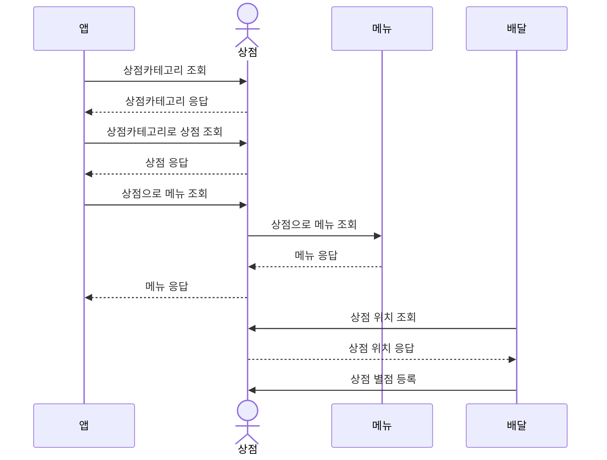
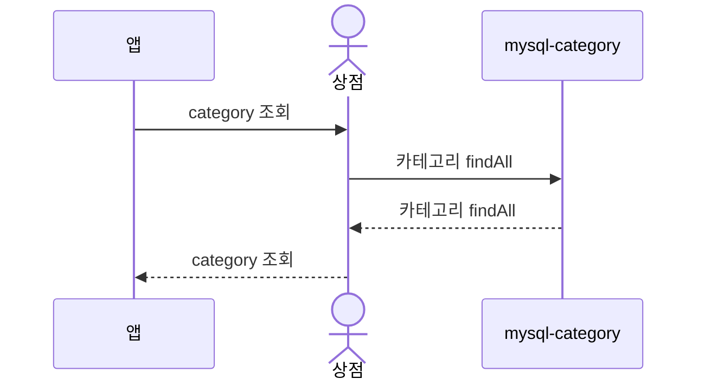
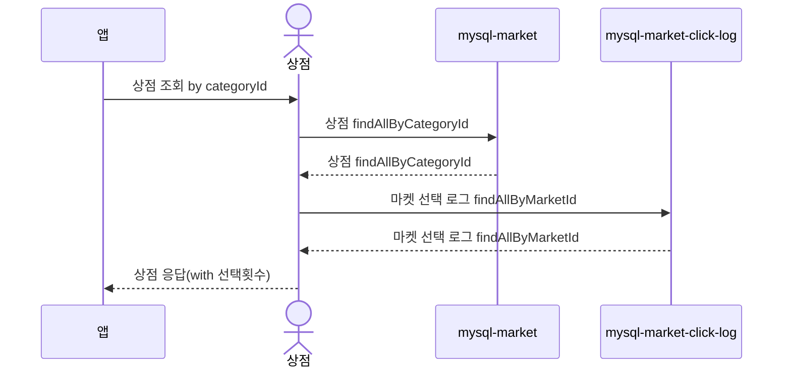
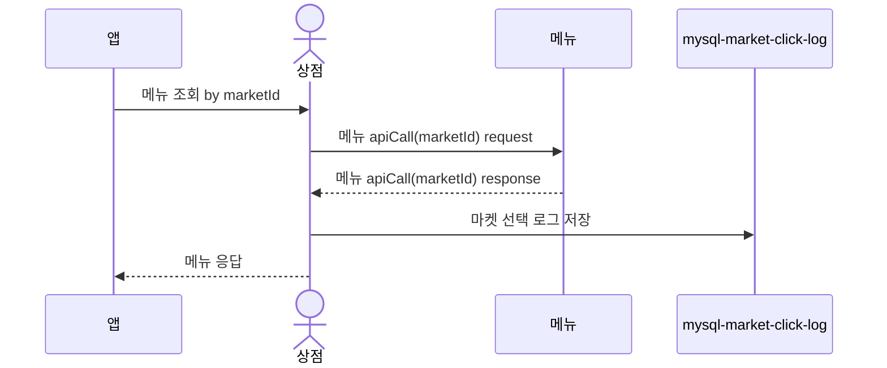
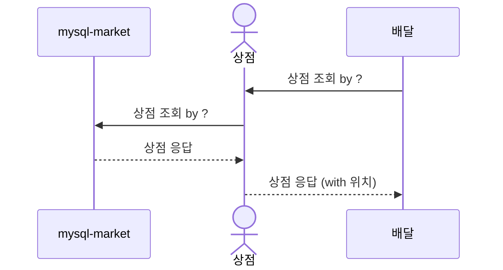
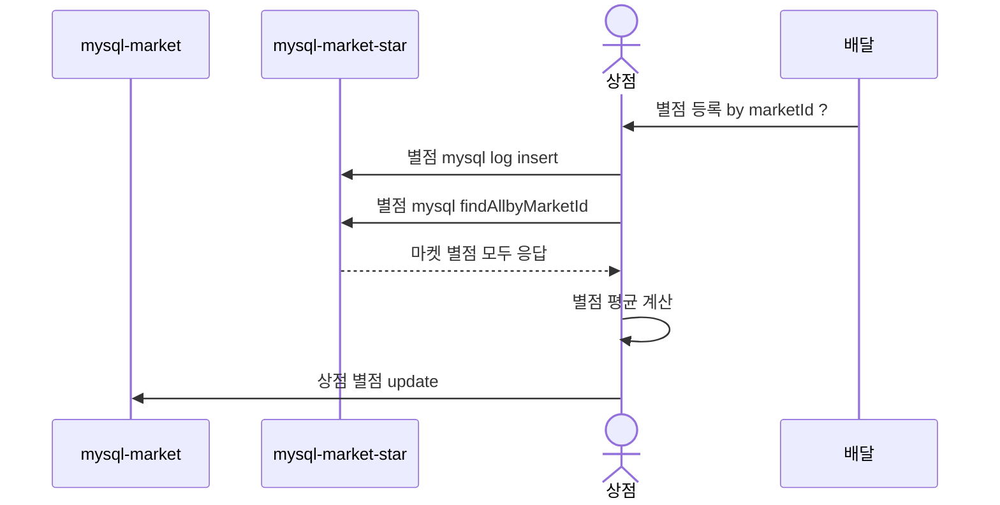

# 상점(market)

## 도메인
1. 상점(market / mysql)
   - 이름
   - 위치
   - 별점
   - 상점소개
   - 상점 카테고리
2. 상점 카테고리(market_category / mysql)
   - 이름
3. 상점 클릭로그(market_click_log / mysql)
   - 상점 ref
   - 조회한 사용자 ref
   - 조회 시간
   - 조회 카테고리 ref
   - 조회 url
4. 상점 별점(market_star_log / mysql)
   - 상점 ref
   - 주문 ref
   - 별점

## API
### 전체 흐름도

### 카테고리 조회

### 상점 조회

### 메뉴 조회

### 배달에서 상점 위치 조회

### 배달에서 상점 별점 등록
